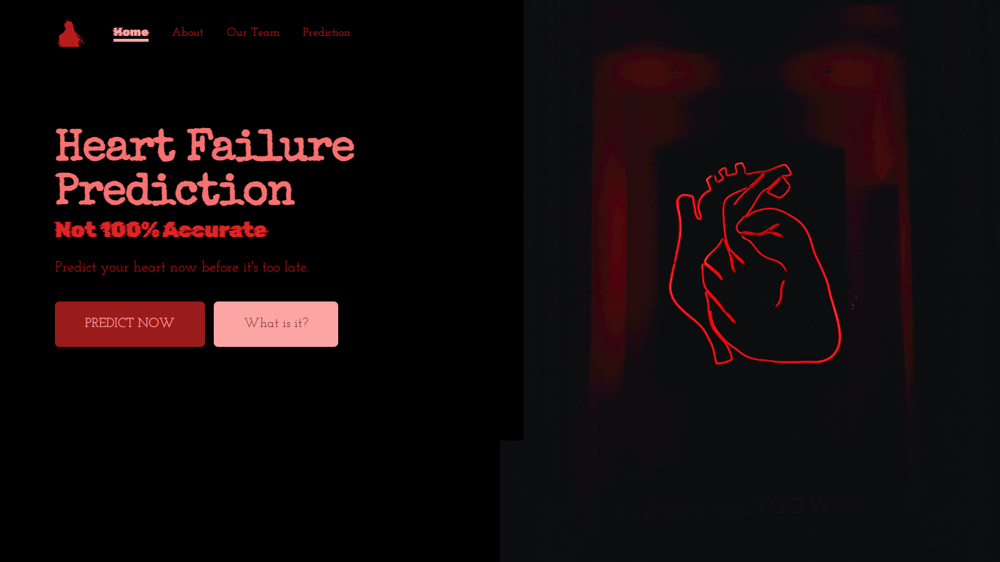

# Heart Failure Prediction

## About

The purpose of this app is to predict your heart. You can click "prediction" or "PREDICT NOW" and then do prediction. Thanks to mentor for guide our team to create fabulous app. The source for learning the model is [HERE](https://www.kaggle.com/datasets/andrewmvd/heart-failure-clinical-data?resource=download) . Thank you for reading this section. I hope, you understand what the purpose of this web.

## Warning

Seriously, don't use this web because the accuration of predition is below 90%. The original purpose for this web is just to do an assigment and not to medical purpose.

## Proccess

I found so many difficult for create this web because it's my first time to create web app with react js + flask.

### Problem 1 : Confuse to send a data from app.py to Prediction.jsx and vice versa

The solution is if you wanna send a data to js, use jsonify(just_random_name = name_a_data_you_want_to_send)
If a data want to display in jsx, use a axios with url that same as route url in flask.

If a data want to post to flask, use axios with post method.

### Problem 2 : DEPLOYING

The solution is this problem is

1. If you wanna push to heroku, don't forget to check the git ignore. Erase a "dist" or "build" name in that.
2. Create venv and then install some library you want to use. Don't forget to install sklearn too.
3. Use pip freeze > requirements.txt and add gunicorn.
4. In app.py in main route, use return send_from_directory()

### Note of Problem

Well, it's just a big problem in that list. Of course, there is many problem in create this. Well, you know, create a code has many problem, right?

## Source

- [Website](https://heart-failure-prediction-g2.herokuapp.com/)
- [Data for Training](https://www.kaggle.com/datasets/andrewmvd/heart-failure-clinical-data?resource=download)
- [Tutorial React with Flask](https://towardsdatascience.com/build-deploy-a-react-flask-app-47a89a5d17d9)
- [Link to original heart failure predict](https://github.com/ZhafranBahij/heart-failure-predict)

## Note

My Friend and i created this app together. My friend make a data more cleaning and he explores a data, so i create a model from that data and deploy the data with the web.

Ohh, if you found so many "Indonesian Language" in a comment. It's because i wanna understand it easier, so i just comment it with Indonesian Language
